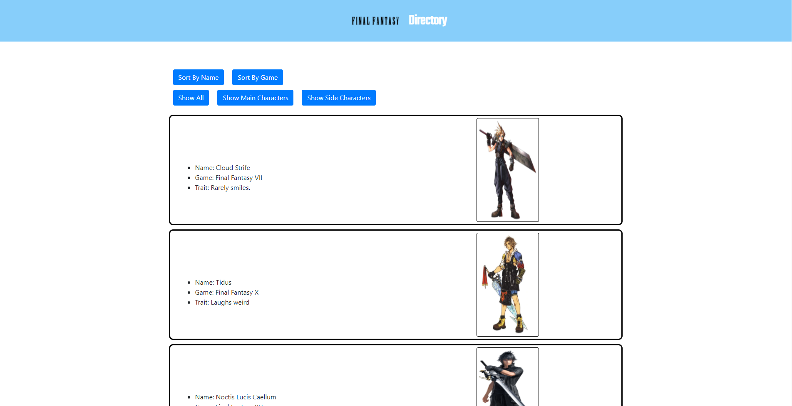

# directory

## Table of Contents 
1. [Description](#description)

2. [Screenshots](#screenshots)

3. [Installation](#installation)

4. [Usage](#usage)

5. [Contributors](#contributors)

6. [Testing](#testing)

7. [Questions](#questions)

    
## Description 
This app is an example of using React. Allows user to sort data via the given buttons (By Name or Game, Filter by Main or Side Characters) . The app uses Final Fantasy characters as an example.

### URL(s)
[Repository](https://github.com/sornwill/directory)
|
[Heroku Deployed Link](https://ws-directory.herokuapp.com/)
      
## Screenshots

    
## Installation
npm i create-react-app, npm i react-bootstrap

## Usage
General Use 
    
## License
MIT 
    
## Contributors
William Sorn 
    
## Testing
n/a 
      
## Questions
Questions? Please send contact me @sornwill or E-mail : sornwilliam@gmail.com
      
